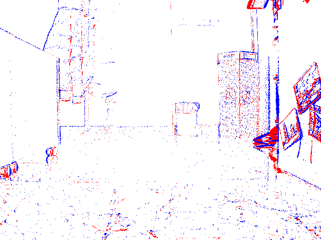
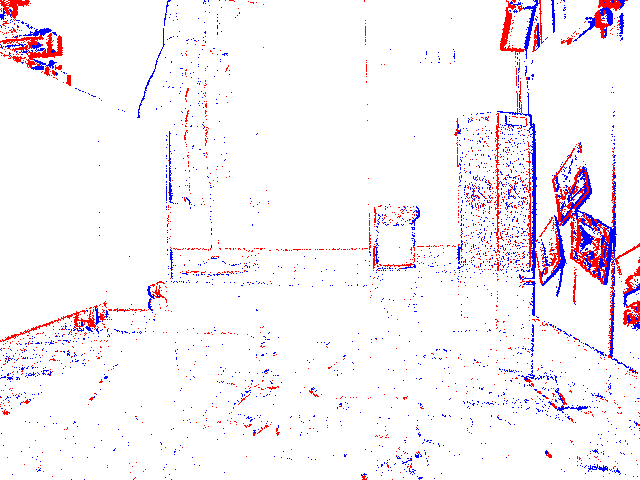
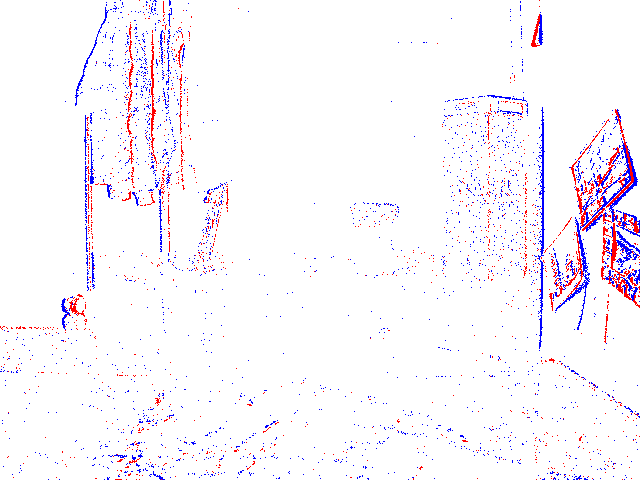
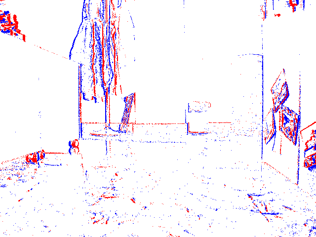
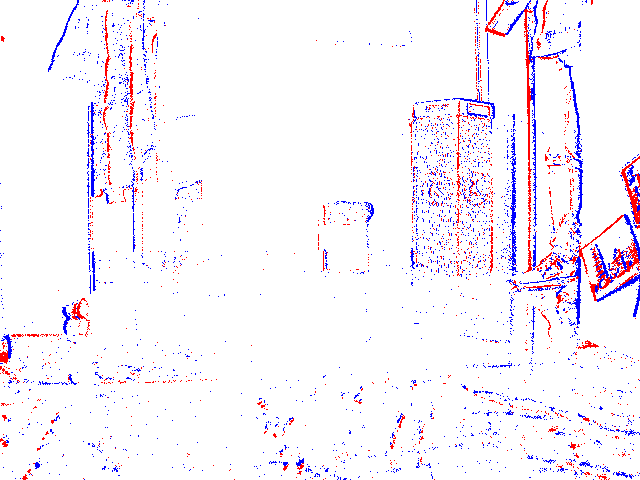
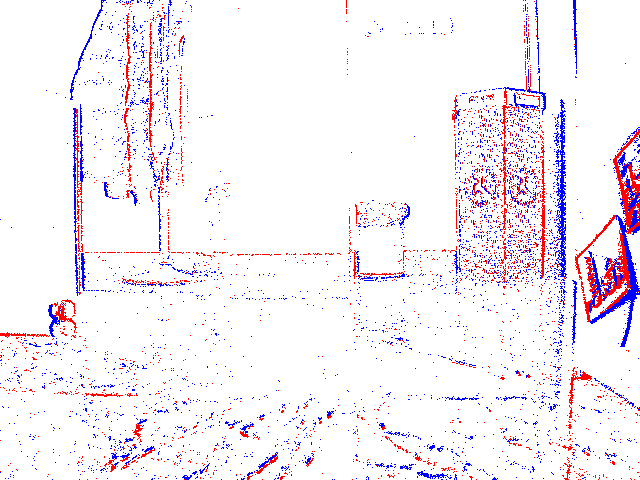
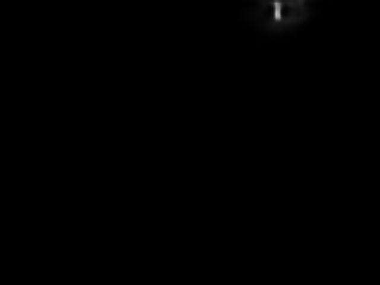

# E-NAVI-Dataset

Conjunto de datos generado con cámaras de eventos para navegación y segmentación.

El conjunto de datos puede ser descargado a través del enlace a [Google Drive](https://drive.google.com/drive/folders/1TcFFqcAzwtiFsdJTQmkGgEA0WsGm5_eJ?usp=sharing).

Este conjunto de datos ha sido utilizado para el TFM sobre "Detección de objetos que se mueven de forma independiente (IMOs) con sensores de eventos". El cuál se puede ver en [este](https://github.com/FranLV/TFM_Fran_Lobon) repositorio de GitHub.

Si se va a utilizar este conjunto de datos por favor citadlo:

```bibtex
@misc{E-NAVI_Dataset_2023,
  author = {Lobón Villanueva, Francisco},
  month = jul,
  title = {{E-NAVI Dataset}},
  year = {2023}
}
```
# Sobre el conjunto de datos

La grabación se ha hecho mediante una cámara Prophesee Gen 3 de 640x480 píxeles. Este conjunto de datos contiene diversas secuencias, todas las secuencias son en interiores con luz natural y se ha utilizado como IMO una pelota chica, otra pelota grande, y una plataforma terrestre (robot Zumo). Las secuencias se distribuyen de la siguiente manera:
- 3 secuencias con la cámara estática a modo de prueba, en una de ellas hay dos pelotas (la grande y la chica) que se mueven en direcciones contrarias.
- 6 secuencias navegando desde una plataforma terrestre con las pelotas tanto en movimiento lento como rápido en diferentes ángulos.
- 1 secuencia navegando desde la plataforma terrestre donde aparece otra plataforma terrestre como IMO (robot Zumo).

A continuación se mostrarán cada una de las secuencias en GIFs junto con una breve descripción y su duración. Hay que tener en cuenta que como son secuencias reales, existen artefactos (como los producidos por las sombras de las pelotas) y movimientos de rotación en la cámara. Además en el cálculo del flujo óptico los casos límite son, por lo general, cuando un objeto se mueve a la misma velocidad a la que va la cámara y cuando la cámara rota.

La segmentación no está disponible ya que ha sido realizada a mano, por ello quien utilice este conjunto de datos deberá realizarlo según sus necesidades. 

# Script Python para cargar una secuencia h5
Para cargar una secuencia basta con este pequeño script.

```python
import h5py

# Cargamos el archivo
data = h5py.File("path to .h5 file", "r")    

# Creamos un diccionario y agregamos cada columna del conjunto de datos donde
# "p" es la polaridad, "x" e "y" es la posición del píxel, 
# y "t" es el tiempo en microsegundos del evento
dataset = dict()
for columns in ['p', 'x', 'y', 't']:
    dataset[columns] = data['events']['table']['{}'.format(columns)]

data.close()

# Para acceder a cada columna
dataset['x']
dataset['y']
dataset['p']
dataset['t']

# Imprimimos el conjunto de datos donde cada fila contiene un array con [p,x,y,t]
print(dataset)

```

# Secuencias

## Pelota chica estática
En esta secuencia la cámara permanece estática y hay una pelota chica que pasa de derecha a izquierda y viceversa. La secuencia tiene una duración de 6.2 segundos.
<div align="center">
  
  
  
</div>

## Pelota grande estática
En esta secuencia la cámara permanece estática y hay una pelota grande que pasa de derecha a izquierda y viceversa. La secuencia tiene una duración de 5.5 segundos.
<div align="center">
  
  
  
</div>

## Pelota chica grande estática
En esta secuencia la cámara permanece estática y hay una pelota grande que pasa de derecha a izquierda y viceversa. La secuencia tiene una duración de 7.2 segundos.
<div align="center">
  
  
  
</div>

## Pelota chica robot movimiento
En esta secuencia la cámara va hacia delante mientras una pelota chica cruza en diagonal de derecha a izquierda. La secuencia tiene una duración de 8.2 segundos.
<div align="center">
  
  
  
</div>

## Pelota chica robot movimiento 2
En esta secuencia la cámara va hacia delante, aunque hay un momento de la secuencia en que la camara hace una rotación hacia la izquierda y derecha, mientras una pelota chica cruza por el lado izquierdo. La secuencia tiene una duración de 8 segundos.
<div align="center">
  
  
  
</div>

## Pelota chica robot movimiento horizontal
En esta secuencia la cámara va hacia delante mientras una pelota chica cruza de derecha a izquierda. La secuencia tiene una duración de 5.8 segundos.
<div align="center">
  
  
  
</div>

## Pelota chica robot movimiento lento
En esta secuencia la cámara va hacia delante mientras una pelota chica pasa lentamente por la izquierda haciendo una curva hacia la izquierda. La secuencia tiene una duración de 7 segundos.
<div align="center">
  
  
  
</div>

## Pelota grande robot movimiento
En esta secuencia la cámara va hacia delante, aunque hay un momento de la secuencia en que la camara hace una rotación hacia la derecha e izquierda, mientras una pelota grande cruza diagonalmente de derecha a izquierda y más adelante se curva hacia la derecha. La secuencia tiene una duración de 8.4 segundos.
<div align="center">
  
  
  
</div>

## Pelota grande robot movimiento horizontal
En esta secuencia la cámara va hacia delante mientras una pelota grande cruza horizontalmente de derecha a izquierda aunque al final hace una curva hacia la cámara. La secuencia tiene una duración de 12.6 segundos.
<div align="center">
  
  
  
</div>

## Robot Zumo robot movimiento
En esta secuencia la cámara va hacia delante mientras un robot zumo se mueve en la misma dirección desde la izquierda. La secuencia tiene una duración de 15.9 segundos.
<div align="center">
  
  
  
</div>

Las imágenes de acumulación de eventos y flujo óptico han sido generadas por E-RAFT mientras que las imágenes de segmentación han sido generadas por MATNet.

# Citas
## Prophesee Gen 3
```bibtex
@misc{propheseeMetavisionPackaged,
	author = {},
	title = {{M}etavision® {P}ackaged {S}ensor | {P}{R}{O}{P}{H}{E}{S}{E}{E} --- prophesee.ai},
	howpublished = {\url{https://www.prophesee.ai/event-based-sensor-packaged/}},
	year = {},
	note = {[Accessed 18-Jun-2023]},
}
```

## E-RAFT
```bibtex
@InProceedings{Gehrig3dv2021,
  author = {Mathias Gehrig and Mario Millh\"ausler and Daniel Gehrig and Davide Scaramuzza},
  title = {E-RAFT: Dense Optical Flow from Event Cameras},
  booktitle = {International Conference on 3D Vision (3DV)},
  year = {2021}
}
```
## MATNet
```bibtex
@inproceedings{zhou2020motion,
  title={Motion-Attentive Transition for Zero-Shot Video Object Segmentation},
  author={Zhou, Tianfei and Wang, Shunzhou and Zhou, Yi and Yao, Yazhou and Li, Jianwu and Shao, Ling},
  booktitle={Proceedings of the 34th AAAI Conference on Artificial Intelligence (AAAI)},
  year={2020},
  pages={13066--13073}
}

@article{zhou2020matnet,
  title={MATNet: Motion-Attentive Transition Network for Zero-Shot Video Object Segmentation},
  author={Zhou, Tianfei and Li, Jianwu and Wang, Shunzhou and Tao, Ran and Shen, Jianbing},
  journal={IEEE Transactions on Image Processing},
  volume={29},
  pages={8326-8338},
  year={2020}
}

@inproceedings{zhou2021unsupervised,
  author = {Zhou, Tianfei and Li, Jianwu and Li, Xueyi and Shao, Ling},
  title = {Target-Aware Object Discovery and Association for Unsupervised Video Multi-Object Segmentation},
  booktitle = {CVPR},
  year = {2021}
}
```